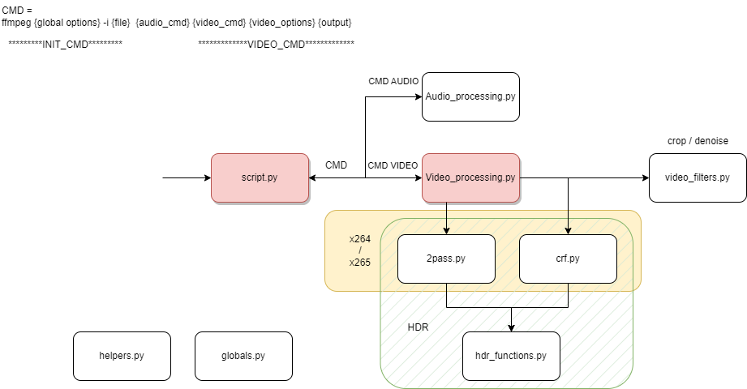

# py_generate_and_launch_ffmpeg_cmd

## User guide

Modify globals.py to fit your needs.

```
usage: script.py [-h] [-2pass BITRATE] [-crf CRF MAXRATE] [--x264] [--x265] [-d] [-nc] [-na] input

optional arguments:
  -h, --help            show this help message and exit
  -2pass BITRATE, --two_pass BITRATE
                        Encode in 2pass
  -crf CRF MAXRATE, --crf CRF MAXRATE
                        Encode using provided CRF and maxrate values
  --x264                Encode in h264, DEFAULT
  --x265                Encode in HEVC
  -d, --dnr             Apply denoising filter
  -nc, --no_crop        Do not autocrop
  -na, --n_audio        Do not reencode audio
```

One encoding mode (2pass or crf) required.

## Developer guide



## Requirements

`ffmpeg`, `dovi_tool` and `hdr10plus_tool` executables in PATH.
